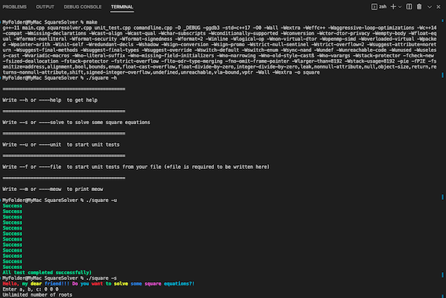
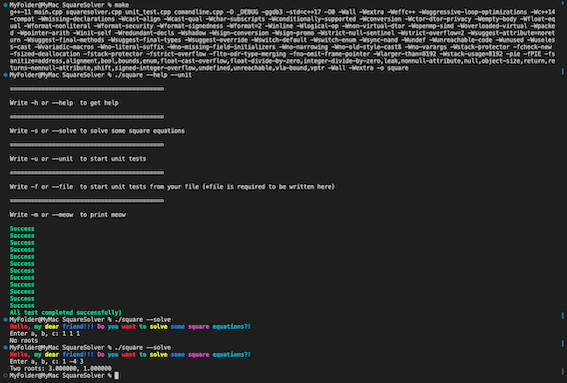

# SquareSolver

This project is made for solving square equations.

_How to install and run:_

  - download files  
  - write 'make' to the command line of the terminal 
  - write ./square and a flag:
  
                              1. -h (or — help) to learn more about flags
                              2. -s (or —solve) to solve equations
                              3. -u (or —uest) to start some unit tests									 
                              4. -m to see a feature
                              5. -f (or —file)  and then name of the file to start some unit tests from the txt file
_How to use:_
  - consistently write coefficients a, b and c, which are stays before x^2, x and term coefficient accordingly (a * x^2 + b * x + c = 0)
  - it is better to use ‘\n’ (enter) or space as separators

_Example of using:_

---------------------------------------------------------

 
Support: nikitin.sv@phystech.edu

For cooperation issues: nikitin.sv@phystech.edu

©NIKITINS CORPORAION INDUSTRY
